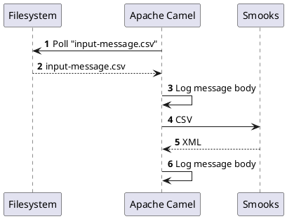

About
=====

This is an example illustrating the use of the [Smooks Camel cartridge](https://github.com/smooks/smooks-camel-cartridge/). Apache Camel is configured in `src/main/resources/META-INF/spring/camel-context.xml` to poll a directory for `input-message.csv`. Once Camel reads the CSV file, it prints the file contents and sends it to Smooks so that the CSV is translated into XML. `<csv:reader .../>` in `smooks-config.xml` ingests the CSV stream and turns it into an XML stream . `<core:result .../>` reads the XML stream into a string and exports the string as a Smooks result which then allows Camel to print the XML output from the [`log`](https://camel.apache.org/components/3.21.x/log-component.html).

#### How to run?

1. `mvn clean install`
2. `mvn exec:exec`
3. `cp input-message.csv input-dir/`

#### UML sequence diagram

```
     ┌──────────┐               ┌────────────┐             ┌──────┐
     │Filesystem│               │Apache Camel│             │Smooks│
     └────┬─────┘               └─────┬──────┘             └──┬───┘
          │ 𝟏 Poll "input-message.csv"│                       │    
          │ <──────────────────────────                       │    
          │                           │                       │    
          │    𝟐 input-message.csv    │                       │    
          │  ─ ─ ─ ─ ─ ─ ─ ─ ─ ─ ─ ─ ─>                       │    
          │                           │                       │    
          │                           │────┐                       
          │                           │    │ 𝟑 Log message body    
          │                           │<───┘                       
          │                           │                       │    
          │                           │         𝟒 CSV         │    
          │                           │ ──────────────────────>    
          │                           │                       │    
          │                           │         𝟓 XML         │    
          │                           │ <─ ─ ─ ─ ─ ─ ─ ─ ─ ─ ─     
          │                           │                       │    
          │                           │────┐                       
          │                           │    │ 𝟔 Log message body    
          │                           │<───┘                       
     ┌────┴─────┐               ┌─────┴──────┐             ┌──┴───┐
     │Filesystem│               │Apache Camel│             │Smooks│
     └──────────┘               └────────────┘             └──────┘

```

#### PlantUML

