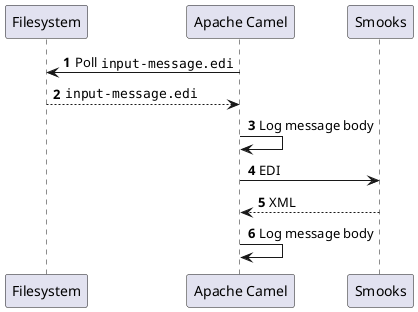

About
=====

This example closely matches the [`camel-csv-to-xml`](/camel/camel-csv-to-xml/README.md) example but with a few notable differences. The input is CSV in `camel-csv-to-xml` while here the input is EDI. Additionally, in this example, Camel invokes Smooks using the [unmarshal EIP](https://camel.apache.org/components/3.21.x/eips/marshal-eip.html) instead of the [to EIP](https://camel.apache.org/components/3.21.x/eips/to-eip.html).

#### How to run?

1. `mvn clean install`
2. `mvn exec:exec`
3. `cp input-message.edi input-dir/`

#### UML sequence diagram

```
     ┌──────────┐                 ┌────────────┐             ┌──────┐
     │Filesystem│                 │Apache Camel│             │Smooks│
     └────┬─────┘                 └─────┬──────┘             └──┬───┘
          │ 𝟏 Poll ""input-message.edi""│                       │    
          │ <────────────────────────────                       │    
          │                             │                       │    
          │   𝟐 ""input-message.edi""   │                       │    
          │  ─ ─ ─ ─ ─ ─ ─ ─ ─ ─ ─ ─ ─ ─>                       │    
          │                             │                       │    
          │                             │────┐                       
          │                             │    │ 𝟑 Log message body    
          │                             │<───┘                       
          │                             │                       │    
          │                             │         𝟒 EDI         │    
          │                             │ ──────────────────────>    
          │                             │                       │    
          │                             │         𝟓 XML         │    
          │                             │ <─ ─ ─ ─ ─ ─ ─ ─ ─ ─ ─     
          │                             │                       │    
          │                             │────┐                       
          │                             │    │ 𝟔 Log message body    
          │                             │<───┘                       
     ┌────┴─────┐                 ┌─────┴──────┐             ┌──┴───┐
     │Filesystem│                 │Apache Camel│             │Smooks│
     └──────────┘                 └────────────┘             └──────┘
```

#### PlantUML

