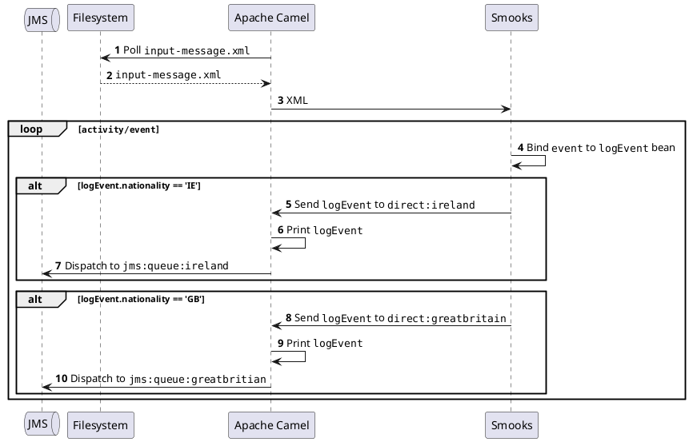

About
=====

An example demonstrating the routing capabilities of the [Smooks Camel Cartridge](https://github.com/smooks/smooks-camel-cartridge/). In particular, the application implements the splitter pattern as documented in the [Enterprise Integration Patterns book](https://www.enterpriseintegrationpatterns.com/patterns/messaging/Sequencer.html).

[Apache Camel](https://camel.apache.org/) is configured in `src/main/java/org/smooks/examples/camel/integration/ExampleRouteBuilder.java` to poll a directory for `input-message.xml`. Once Camel reads the XML file, it prints the file contents and sends it to Smooks. `<jb:bean ...>` in `smooks-config.xml` creates a `LogEvent` for each `activity/event` XML element in the file. The nested `<jb:value .../>` visitors bind the bean's properties to the element's attributes and text content. On binding a `LogEvent` bean to an `event` element, Smooks routes the bean to one of two [direct channels](https://camel.apache.org/components/3.21.x/direct-component.html), depending on the country code of the event. Camel consumes the `LogEvent` from the direct channel and dispatches it to a JMS queue. Note that the JMS queue is mocked in order to keep the example simple to run.

### How to run?

1. `mvn clean install`
2. `mvn exec:exec`
3. `cp input-message.xml input-dir/`

#### UML sequence diagram

```
                              ┌───┐          ┌──────────┐                 ┌────────────┐                                     ┌──────┐                                            
                              │JMS│          │Filesystem│                 │Apache Camel│                                     │Smooks│                                            
                              └───┘          └────┬─────┘                 └─────┬──────┘                                     └──┬───┘                                            
                                │                 │ 𝟏 Poll ""input-message.xml""│                                               │                                                
                                │                 │ <────────────────────────────                                               │                                                
                                │                 │                             │                                               │                                                
                                │                 │   𝟐 ""input-message.xml""   │                                               │                                                
                                │                 │  ─ ─ ─ ─ ─ ─ ─ ─ ─ ─ ─ ─ ─ ─>                                               │                                                
                                │                 │                             │                                               │                                                
                                │                 │                             │                     𝟑 XML                     │                                                
                                │                 │                             │ ──────────────────────────────────────────────>                                                
                                │                 │                             │                                               │                                                
                                │                 │                             │                                               │                                                
          ╔═══════╤═════════════╪═════════════════╪═════════════════════════════╪═══════════════════════════════════════════════╪═══════════════════════════════════════════════╗
          ║ LOOP  │  ""activity/event""           │                             │                                               │                                               ║
          ╟───────┘             │                 │                             │                                               │                                               ║
          ║                     │                 │                             │                                               │────┐                                          ║
          ║                     │                 │                             │                                               │    │ 𝟒 Bind ""event"" to ""logEvent"" bean    ║
          ║                     │                 │                             │                                               │<───┘                                          ║
          ║                     │                 │                             │                                               │                                               ║
          ║                     │                 │                             │                                               │                                               ║
          ║         ╔══════╤════╪═════════════════╪═════════════════════════════╪═══════════════════════════════════════════════╪═════════════╗                                 ║
          ║         ║ ALT  │  logEvent.nationality == 'IE'                      │                                               │             ║                                 ║
          ║         ╟──────┘    │                 │                             │                                               │             ║                                 ║
          ║         ║           │                 │                             │   𝟓 Send ""logEvent"" to ""direct:ireland""   │             ║                                 ║
          ║         ║           │                 │                             │ <──────────────────────────────────────────────             ║                                 ║
          ║         ║           │                 │                             │                                               │             ║                                 ║
          ║         ║           │                 │                             │────┐                                          │             ║                                 ║
          ║         ║           │                 │                             │    │ 𝟔 Print ""logEvent""                     │             ║                                 ║
          ║         ║           │                 │                             │<───┘                                          │             ║                                 ║
          ║         ║           │                 │                             │                                               │             ║                                 ║
          ║         ║           │     𝟕 Dispatch to ""jms:queue:ireland""       │                                               │             ║                                 ║
          ║         ║           │<──────────────────────────────────────────────│                                               │             ║                                 ║
          ║         ╚═══════════╪═════════════════╪═════════════════════════════╪═══════════════════════════════════════════════╪═════════════╝                                 ║
          ║                     │                 │                             │                                               │                                               ║
          ║                     │                 │                             │                                               │                                               ║
          ║         ╔══════╤════╪═════════════════╪═════════════════════════════╪═══════════════════════════════════════════════╪═════════════╗                                 ║
          ║         ║ ALT  │  logEvent.nationality == 'GB'                      │                                               │             ║                                 ║
          ║         ╟──────┘    │                 │                             │                                               │             ║                                 ║
          ║         ║           │                 │                             │ 𝟖 Send ""logEvent"" to ""direct:greatbritain""│             ║                                 ║
          ║         ║           │                 │                             │ <──────────────────────────────────────────────             ║                                 ║
          ║         ║           │                 │                             │                                               │             ║                                 ║
          ║         ║           │                 │                             │────┐                                          │             ║                                 ║
          ║         ║           │                 │                             │    │ 𝟗 Print ""logEvent""                     │             ║                                 ║
          ║         ║           │                 │                             │<───┘                                          │             ║                                 ║
          ║         ║           │                 │                             │                                               │             ║                                 ║
          ║         ║           │  𝟏𝟎 Dispatch to ""jms:queue:greatbritian""    │                                               │             ║                                 ║
          ║         ║           │<──────────────────────────────────────────────│                                               │             ║                                 ║
          ║         ╚═══════════╪═════════════════╪═════════════════════════════╪═══════════════════════════════════════════════╪═════════════╝                                 ║
          ╚═════════════════════╪═════════════════╪═════════════════════════════╪═══════════════════════════════════════════════╪═══════════════════════════════════════════════╝
                              ┌───┐          ┌────┴─────┐                 ┌─────┴──────┐                                     ┌──┴───┐                                            
                              │JMS│          │Filesystem│                 │Apache Camel│                                     │Smooks│                                            
                              └───┘          └──────────┘                 └────────────┘                                     └──────┘                                                                                                 
```

#### PlantUML

