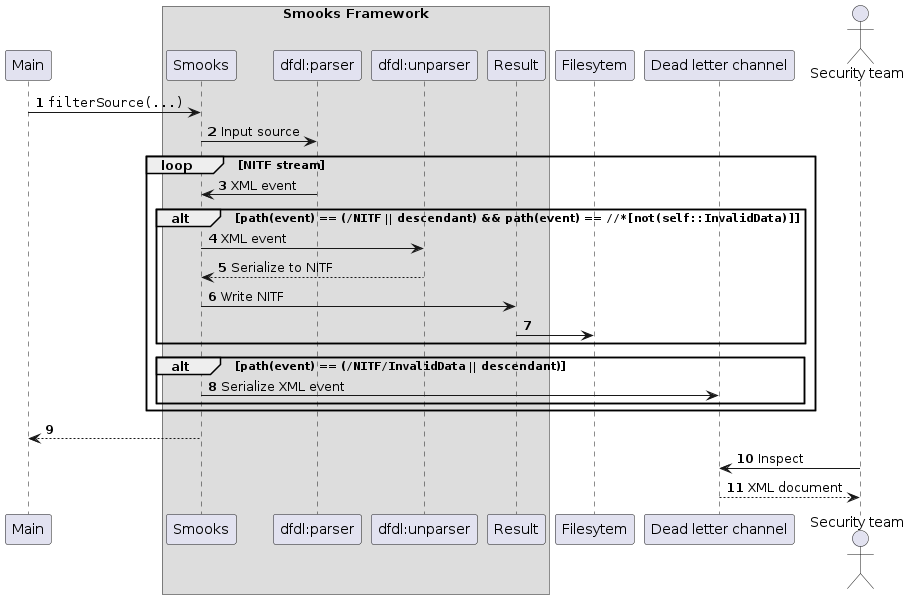

About
=====

In the cyber security space, a [cross domain solution](https://www.cyber.gov.au/acsc/view-all-content/publications/fundamentals-cross-domain-solutions) is a bridge connecting two different security domains, permitting data to flow from one domain into another while minimising the associated security risks. A filter, or more formally a [verification engine](https://www.ncsc.gov.uk/collection/cross-domain-solutions/using-the-principles/content-based-attack-protection), is a suggested component in a cross domain solution.

<br/>

<br/>

A filter inspects the content flowing through the bridge. Data failing inspection is captured for investigation by the security team. 

This example implements a filter in Smooks where [NITF](https://en.wikipedia.org/wiki/National_Imagery_Transmission_Format) (National Imagery Transmission Format) files are imported from an untrusted system into a trusted one. Widely used in national security systems, NITF is a binary file format that encapsulates imagery (e.g., JPEG) and its metadata. As part of the import, Smooks unpacks the NITF stream, ensures it's as expected, and repacks it before routing the repacked NITF stream to its destination. Should verification fail, Smooks puts the bad data put aside for human intervention.

### How to run?

1. `mvn clean install`
2. `mvn exec:exec`

#### UML sequence diagram

```
              ┌────┐          ┌──────┐          ┌───────────┐          ┌─────────────┐          ┌──────┐          ┌───────────────────┐          ┌─────────────┐
              │Main│          │Smooks│          │dfdl:parser│          │dfdl:unparser│          │Result│          │Dead letter channel│          │Security team│
              └─┬──┘          └──┬───┘          └─────┬─────┘          └──────┬──────┘          └──┬───┘          └─────────┬─────────┘          └──────┬──────┘
                │    NITF file   │                    │                       │                    │                        │                           │       
                │ ───────────────>                    │                       │                    │                        │                           │       
                │                │                    │                       │                    │                        │                           │       
                │                │                    │                       │                    │                        │                           │       
                │                │ ──────────────────>│                       │                    │                        │                           │       
                │                │                    │                       │                    │                        │                           │       
                │                │  XML event stream  │                       │                    │                        │                           │       
                │                │ <─ ─ ─ ─ ─ ─ ─ ─ ─ │                       │                    │                        │                           │       
                │                │                    │                       │                    │                        │                           │       
                │                │                    │                       │                    │                        │                           │       
          ╔═════╪═╤══════════════╪════════════════════╪═══════════════════════╪════════════════════╪═══════════════════════╗│                           │       
          ║ LOOP  │  ""/NITF"" event and its descendants                      │                    │                       ║│                           │       
          ╟───────┘              │                    │                       │                    │                       ║│                           │       
          ║     │                │                    │                       │                    │                       ║│                           │       
          ║     │   ╔══════╤═════╪════════════════════╪═══════════════════════╪════════════════════╪═════════════╗         ║│                           │       
          ║     │   ║ ALT  │  ""//*[not(self::InvalidData)]""                 │                    │             ║         ║│                           │       
          ║     │   ╟──────┘     │                    │                       │                    │             ║         ║│                           │       
          ║     │   ║            │                 XML event                  │                    │             ║         ║│                           │       
          ║     │   ║            │ ──────────────────────────────────────────>│                    │             ║         ║│                           │       
          ║     │   ║            │                    │                       │                    │             ║         ║│                           │       
          ║     │   ║            │                    │                       │ Serialize to NITF  │             ║         ║│                           │       
          ║     │   ║            │                    │                       │───────────────────>│             ║         ║│                           │       
          ║     │   ║            │                    │                       │                    │             ║         ║│                           │       
          ║     │   ║            │                    │                       │                    │             ║         ║│                           │       
          ║     │   ║            │ <─ ─ ─ ─ ─ ─ ─ ─ ─ ─ ─ ─ ─ ─ ─ ─ ─ ─ ─ ─ ─ │                    │             ║         ║│                           │       
          ║     │   ╚════════════╪════════════════════╪═══════════════════════╪════════════════════╪═════════════╝         ║│                           │       
          ╚═════╪════════════════╪════════════════════╪═══════════════════════╪════════════════════╪═══════════════════════╝│                           │       
                │                │                    │                       │                    │                        │                           │       
                │                │                    │                       │                    │                        │                           │       
                │   ╔═══════╤════╪════════════════════╪═══════════════════════╪════════════════════╪════════════════════════╪═══════════════════╗       │       
                │   ║ LOOP  │  ""/NITF/InvalidData"" event and its descendants│                    │                        │                   ║       │       
                │   ╟───────┘    │                    │                       │                    │                        │                   ║       │       
                │   ║            │                    │              Serialize XML event           │                        │                   ║       │       
                │   ║            │ ────────────────────────────────────────────────────────────────────────────────────────>│                   ║       │       
                │   ╚════════════╪════════════════════╪═══════════════════════╪════════════════════╪════════════════════════╪═══════════════════╝       │       
                │                │                    │                       │                    │                        │                           │       
                │                │                   Read result              │                    │                        │                           │       
                │ ─────────────────────────────────────────────────────────────────────────────────>                        │                           │       
                │                │                    │                       │                    │                        │                           │       
                │                │                    │ NITF                  │                    │                        │                           │       
                │ <─ ─ ─ ─ ─ ─ ─ ─ ─ ─ ─ ─ ─ ─ ─ ─ ─ ─ ─ ─ ─ ─ ─ ─ ─ ─ ─ ─ ─ ─ ─ ─ ─ ─ ─ ─ ─ ─ ─ ─ ─                        │                           │       
                │                │                    │                       │                    │                        │                           │       
                │                │                    │                       │                    │                        │         Inspect           │       
                │                │                    │                       │                    │                        │<──────────────────────────│       
                │                │                    │                       │                    │                        │                           │       
                │                │                    │                       │                    │                        │       XML document        │       
                │                │                    │                       │                    │                        │ ─ ─ ─ ─ ─ ─ ─ ─ ─ ─ ─ ─ ─>│       
              ┌─┴──┐          ┌──┴───┐          ┌─────┴─────┐          ┌──────┴──────┐          ┌──┴───┐          ┌─────────┴─────────┐          ┌──────┴──────┐
              │Main│          │Smooks│          │dfdl:parser│          │dfdl:unparser│          │Result│          │Dead letter channel│          │Security team│
              └────┘          └──────┘          └───────────┘          └─────────────┘          └──────┘          └───────────────────┘          └─────────────┘

```

#### PlantUML

