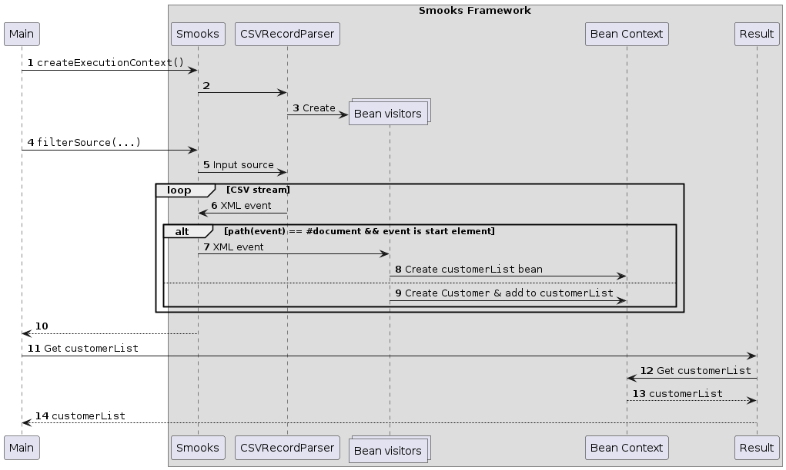

About
=====

This example closely mirrors the [csv-to-java](../csv-to-java/README.md) example. The only notable difference is that this application configures Smooks programmatically in [`org.smooks.examples.csv2java.Main`](src/main/java/org/smooks/examples/csv2java/Main.java). This means that no `smook-config.xml` file exists.

### How to run?

1. `mvn clean package`
2. `mvn exec:exec`

### UML Sequence Diagram

