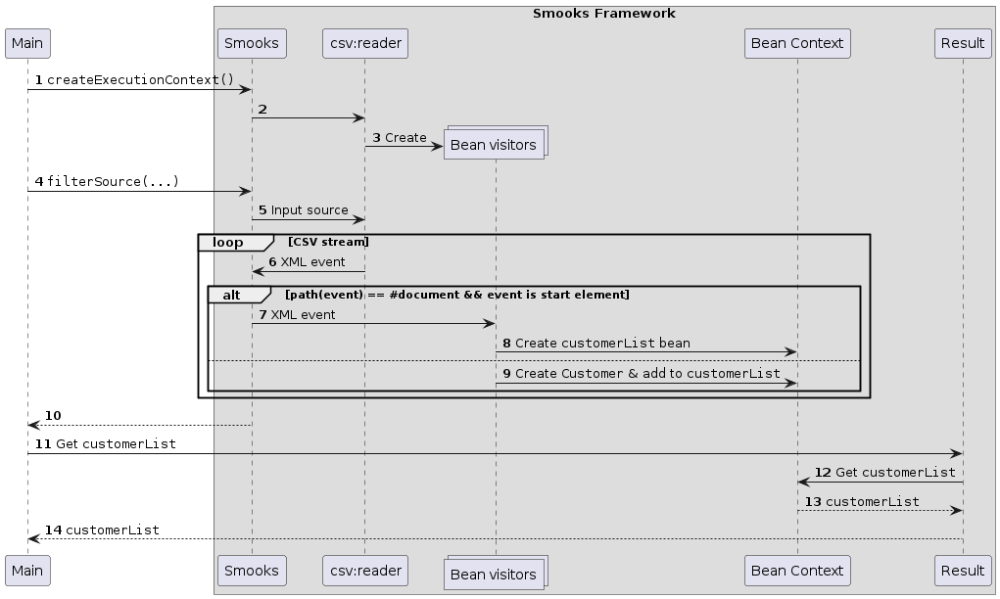

About
=====

This is an example illustrating the XML configuration of Smooks for binding CSV records to Java beans with the help of the [CSV](https://github.com/smooks/smooks-csv-cartridge) and [JavaBean cartridges](https://github.com/smooks/smooks-javabean-cartridge). Attention should be given to the `smook-config.xml` file:

```xml
<?xml version="1.0"?>
<smooks-resource-list xmlns="https://www.smooks.org/xsd/smooks-2.0.xsd"
                      xmlns:csv="https://www.smooks.org/xsd/smooks/csv-1.7.xsd">

    <csv:reader fields="firstName,lastName,gender,age,country">
        <csv:listBinding beanId="customerList" class="org.smooks.examples.csv2java.Customer"/>
    </csv:reader>

</smooks-resource-list>
```

`csv:reader` parses each field in [`input-message.csv`](input-message.csv), to go on and bind the field to a property in [`org.smooks.examples.csv2java.Customer`](src/main/java/org/smooks/examples/csv2java/Customer.java) where the field name matches the property name. `beanId="customerList"` configures one of the bean visitors to create a list named `customerList` so that the `Customer` beans can be added to it.

Under the covers, `csv:reader` dynamically creates bean visitors to instantiate `Customer` beans and bind CSV records to these beans. The process of binding is transparent when the target is of primitive or predefined type like a `String`. However, for user-defined types, a `TypeConverterFactory` needs to be defined and registered. The `Ǵender` property in `Customer` is one such user-defined type because it is an `Enum`. Therefore, the example defines `TypeConverterFactory` for `Gender` in [`org.smooks.examples.csv2java.GenderTypeConverterFactory`](src/main/java/org/smooks/examples/csv2java/GenderTypeConverterFactory.java) and registered as such in [`src/main/resources/META-INF/services/org.smooks.api.converter.TypeConverterFactory`](src/main/resources/META-INF/services/org.smooks.api.converter.TypeConverterFactory)

[`org.smooks.examples.csv2java.Main`](src/main/java/org/smooks/examples/csv2java/Main.java) expects the result from the Smooks execution to be a Java bean since it passes a `org.smooks.io.payload.JavaResult` to `filterSource(...)`. After the Smooks execution, `Main` prints the list of customers by getting the `customerList` bean from `JavaResult`.  

You can see how to solve the same use-case, but programmatically (i.e., non-XML config), in the [`csv-to-java-programmatic`](../csv-to-java-programmatic/README.md) example.

### How to run?

1. `mvn clean package`
2. `mvn exec:exec`

### UML Sequence Diagram

