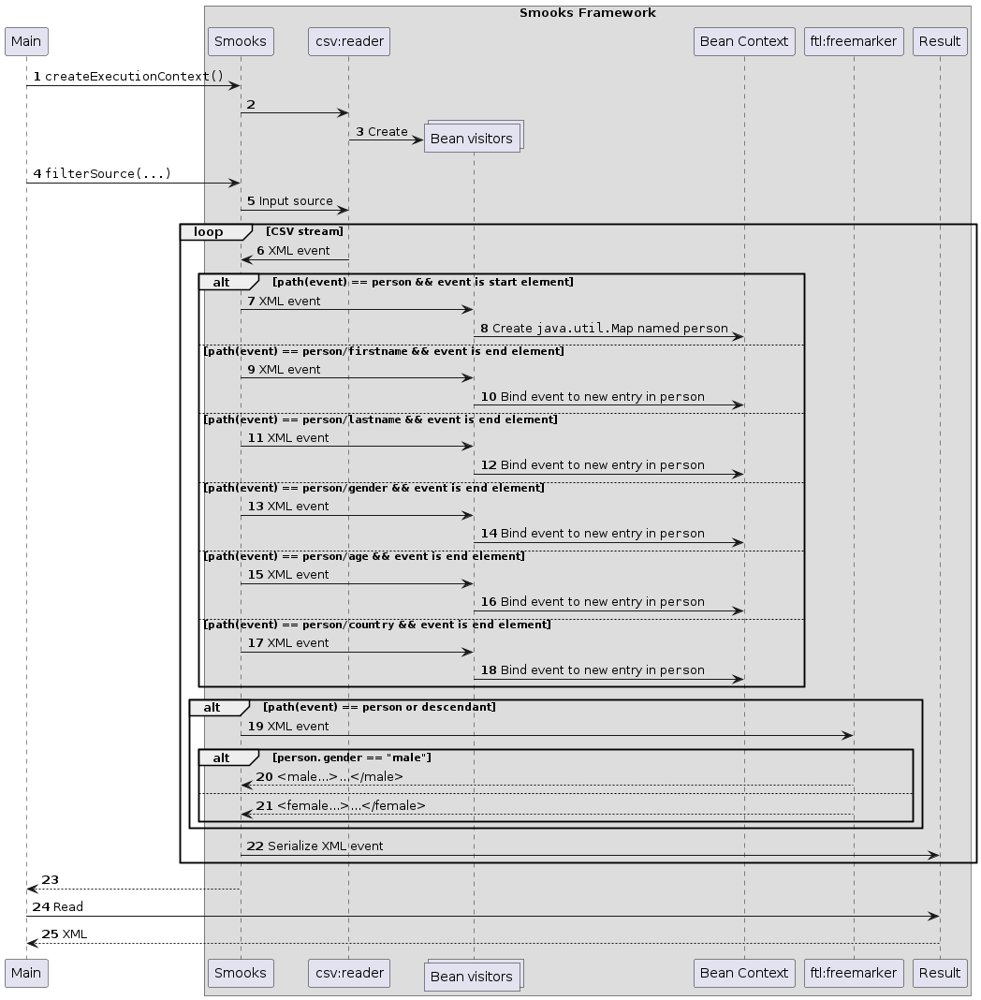

About
=====

This example extends the [`csv-to-xml`](../csv-to-xml/README.md) example by demonstrating how to perform a transformation on the individual records in the CSV. This example also demonstrates how to define string functions in the field declaration of `csv:reader`.

### How to run?

1. `mvn clean package`
2. `mvn exec:exec`

### UML Sequence Diagram

