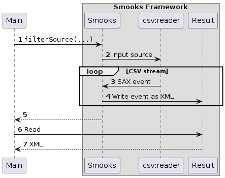

About
=====

This is an example illustrating Smooks configured with a non-XML stream reader, that is, CSV. This capability allows Smooks to be used for processing any hierarchical data; not only XML! The [`edi-to-xml`](../edi-to-xml/README.md) example also illustrates this capability but the input source there is an EDI stream.

### How to run?

1. `mvn clean package`
2. `mvn exec:exec`

### UML Sequence Diagram

