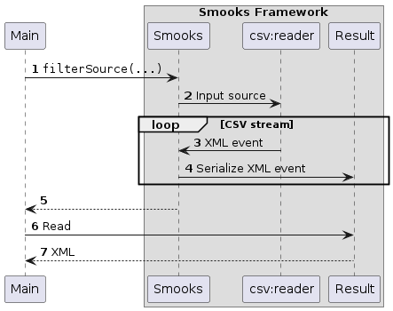

About
=====

This example illustrates how to configure Smooks to process variable record CSV, where the first CSV field name denotes the name for that record.

See:
    1. The "Main" class in src/main/java/example/Main.java.
    2. The input message in input-message.csv.
    3. smooks-config.xml.

### How to run?

1. `mvn clean package`
2. `mvn exec:exec`

### UML Sequence Diagram

