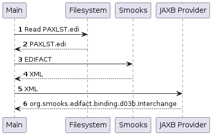

About
=====

Reads an EDIFACT document from the filesystem and feeds it to Smooks to obtain the EDIFACT's XML representation. The returned XML is then bound to a `org.smooks.edifact.binding.d03b.Interchange` POJO with JAXB.  

### How to run?

1. `mvn clean package`
2. `mvn exec:exec`

### UML Sequence Diagram

