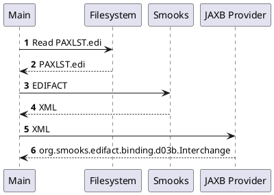

About this example
==================

Reads an EDIFACT document from the filesystem and feeds it to Smooks to obtain the EDIFACT's XML representation. The returned XML is then bound to a `org.smooks.edifact.binding.d03b.Interchange` POJO with JAXB.  

#### UML sequence diagram

```
     ┌────┐          ┌──────────┐          ┌──────┐          ┌─────────────┐
     │Main│          │Filesystem│          │Smooks│          │JAXB Provider│
     └─┬──┘          └────┬─────┘          └──┬───┘          └──────┬──────┘
       │ 𝟏 Read PAXLST.edi│                   │                     │       
       │ ─────────────────>                   │                     │       
       │                  │                   │                     │       
       │   𝟐 PAXLST.edi   │                   │                     │       
       │ <─ ─ ─ ─ ─ ─ ─ ─ ─                   │                     │       
       │                  │                   │                     │       
       │               𝟑 EDIFACT              │                     │       
       │ ─────────────────────────────────────>                     │       
       │                  │                   │                     │       
       │                 𝟒 XML                │                     │       
       │ <─ ─ ─ ─ ─ ─ ─ ─ ─ ─ ─ ─ ─ ─ ─ ─ ─ ─ ─                     │       
       │                  │                   │                     │       
       │                  │        𝟓 XML      │                     │       
       │ ──────────────────────────────────────────────────────────>│       
       │                  │                   │                     │       
       │       𝟔 org.smooks.edifact.binding.d03b.Interchange        │       
       │ <─ ─ ─ ─ ─ ─ ─ ─ ─ ─ ─ ─ ─ ─ ─ ─ ─ ─ ─ ─ ─ ─ ─ ─ ─ ─ ─ ─ ─ │       
     ┌─┴──┐          ┌────┴─────┐          ┌──┴───┐          ┌──────┴──────┐
     │Main│          │Filesystem│          │Smooks│          │JAXB Provider│
     └────┘          └──────────┘          └──────┘          └─────────────┘
```

#### PlantUML


