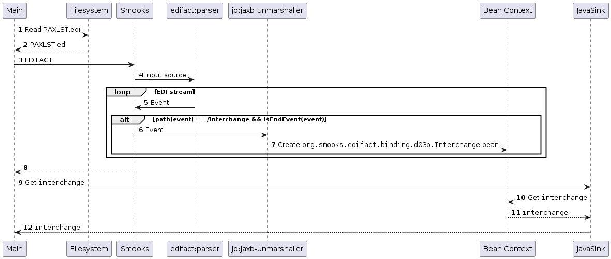

About
=====

Illustrates automatic mapping of an EDIFACT document to Java objects. This project reads an EDIFACT document from the filesystem and feeds it to Smooks with `edifact:parser`. The ingested events are then bound to a instance of the [JAXB](https://javaee.github.io/jaxb-v2/) class `org.smooks.edifact.binding.d03b.Interchange` thanks to the `jb:jaxb-unmarshaller` visitor which is available from the [JavaBean cartridge](https://www.smooks.org/documentation/#javabeans). `jb:jaxb-unmarshaller` saves the `org.smooks.edifact.binding.d03b.Interchange` instance to the bean context so that it can be retrieved later on from the `JavaSink`.

To control the mapping between EDIFACT to Java objects, as opposed to automatic mapping, other JavaBean cartridge visitors are recommended like `jb:bean` or `jb:value`. Visit the [edi-to-java project](../edi-to-java/README.md) to view an example that defines the EDI mapping. Note that the `edi-to-java` example configures to read plain EDI but this configuration can be easily customised to use `edifact:parser` instead of `edi:parser`.

### How to run?

1. `mvn clean package`
2. `mvn exec:exec`

### UML Sequence Diagram

