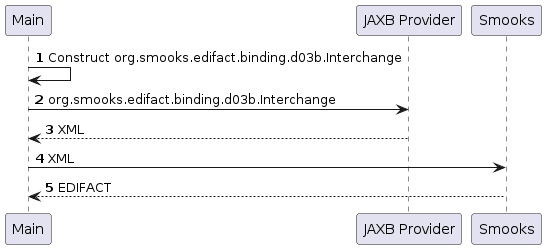

About
=====

Constructs a document in Java to then turn into XML with JAXB and feed the XML into Smooks in order to obtain EDIFACT. Smooks is configured programmatically which allows us to set the parameters like the message type at run-time. 

When following this approach, it is advised that the Smooks instance is cached so that compiled EDIFACT schemas can be reused.

### How to run?

1. `mvn clean package`
2. `mvn exec:exec`

### UML Sequence Diagram

