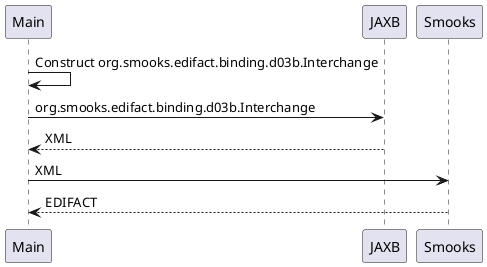

About this example
==================

Constructs a document in Java to then turn into XML with JAXB and feed the XML into Smooks in order to obtain EDIFACT. Smooks is configured programmatically which allows us to set the parameters like the message type at run-time. 

One word of caution about thread-safety. Avoid the temptation of concurrently adding resource configs to the Smooks instance. `Smooks#addConfiguration(...)` and `Smooks#addVisitor(...)` are **NOT thread-safe**. Conversely, `Smooks#filterSource(...)` is thread-safe and can be invoked concurrently.

When following this approach, it is advised that the Smooks instance is cached so that compiled EDIFACT schemas can be reused.

#### UML sequence diagram
```
     ┌────┐                                                     ┌────┐          ┌──────┐
     │Main│                                                     │JAXB│          │Smooks│
     └─┬──┘                                                     └─┬──┘          └──┬───┘
       │────┐                                                                      │    
       │    │ Construct org.smooks.edifact.binding.d03b.Interchange                │    
       │<───┘                                                                      │    
       │                                                          │                │    
       │        org.smooks.edifact.binding.d03b.Interchange       │                │    
       │ ─────────────────────────────────────────────────────────>                │    
       │                                                          │                │    
       │                            XML                           │                │    
       │ <─ ─ ─ ─ ─ ─ ─ ─ ─ ─ ─ ─ ─ ─ ─ ─ ─ ─ ─ ─ ─ ─ ─ ─ ─ ─ ─ ─ ─                │    
       │                                                          │                │    
       │                                    XML                   │                │    
       │ ──────────────────────────────────────────────────────────────────────────>    
       │                                                          │                │    
       │                                  EDIFACT                 │                │    
       │ <─ ─ ─ ─ ─ ─ ─ ─ ─ ─ ─ ─ ─ ─ ─ ─ ─ ─ ─ ─ ─ ─ ─ ─ ─ ─ ─ ─ ─ ─ ─ ─ ─ ─ ─ ─ ─     
     ┌─┴──┐                                                     ┌─┴──┐          ┌──┴───┐
     │Main│                                                     │JAXB│          │Smooks│
     └────┘                                                     └────┘          └──────┘
```

#### PlantUML


