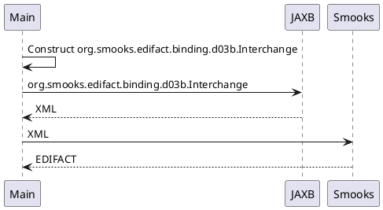

About this example
==================

Constructs a document in Java to then turn into XML with JAXB and feed the XML into Smooks in order to obtain EDIFACT.  

#### UML sequence diagram
```
     ┌────┐                                                     ┌────┐          ┌──────┐
     │Main│                                                     │JAXB│          │Smooks│
     └─┬──┘                                                     └─┬──┘          └──┬───┘
       │────┐                                                                      │    
       │    │ Construct org.smooks.edifact.binding.d03b.Interchange                │    
       │<───┘                                                                      │    
       │                                                          │                │    
       │        org.smooks.edifact.binding.d03b.Interchange       │                │    
       │ ─────────────────────────────────────────────────────────>                │    
       │                                                          │                │    
       │                            XML                           │                │    
       │ <─ ─ ─ ─ ─ ─ ─ ─ ─ ─ ─ ─ ─ ─ ─ ─ ─ ─ ─ ─ ─ ─ ─ ─ ─ ─ ─ ─ ─                │    
       │                                                          │                │    
       │                                    XML                   │                │    
       │ ──────────────────────────────────────────────────────────────────────────>    
       │                                                          │                │    
       │                                  EDIFACT                 │                │    
       │ <─ ─ ─ ─ ─ ─ ─ ─ ─ ─ ─ ─ ─ ─ ─ ─ ─ ─ ─ ─ ─ ─ ─ ─ ─ ─ ─ ─ ─ ─ ─ ─ ─ ─ ─ ─ ─     
     ┌─┴──┐                                                     ┌─┴──┐          ┌──┴───┐
     │Main│                                                     │JAXB│          │Smooks│
     └────┘                                                     └────┘          └──────┘
```

#### PlantUML


