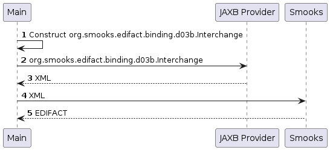

About
=====

Constructs a document in Java to then turn into XML with JAXB and feed the XML into Smooks in order to obtain EDIFACT.  

### How to run?

1. `mvn clean package`
2. `mvn exec:exec`

### UML Sequence Diagram

