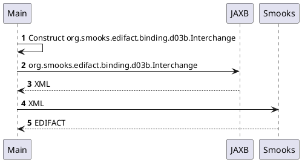

About this example
==================

Constructs a document in Java to then turn into XML with JAXB and feed the XML into Smooks in order to obtain EDIFACT.  

#### UML sequence diagram

```
     ┌────┐                                                       ┌────┐          ┌──────┐
     │Main│                                                       │JAXB│          │Smooks│
     └─┬──┘                                                       └─┬──┘          └──┬───┘
       │────┐                                                                        │    
       │    │ 𝟏 Construct org.smooks.edifact.binding.d03b.Interchange                │    
       │<───┘                                                                        │    
       │                                                            │                │    
       │        𝟐 org.smooks.edifact.binding.d03b.Interchange       │                │    
       │ ───────────────────────────────────────────────────────────>                │    
       │                                                            │                │    
       │                            𝟑 XML                           │                │    
       │ <─ ─ ─ ─ ─ ─ ─ ─ ─ ─ ─ ─ ─ ─ ─ ─ ─ ─ ─ ─ ─ ─ ─ ─ ─ ─ ─ ─ ─ ─                │    
       │                                                            │                │    
       │                                    𝟒 XML                   │                │    
       │ ────────────────────────────────────────────────────────────────────────────>    
       │                                                            │                │    
       │                                  𝟓 EDIFACT                 │                │    
       │ <─ ─ ─ ─ ─ ─ ─ ─ ─ ─ ─ ─ ─ ─ ─ ─ ─ ─ ─ ─ ─ ─ ─ ─ ─ ─ ─ ─ ─ ─ ─ ─ ─ ─ ─ ─ ─ ─     
     ┌─┴──┐                                                       ┌─┴──┐          ┌──┴───┐
     │Main│                                                       │JAXB│          │Smooks│
     └────┘                                                       └────┘          └──────┘
```

#### PlantUML


