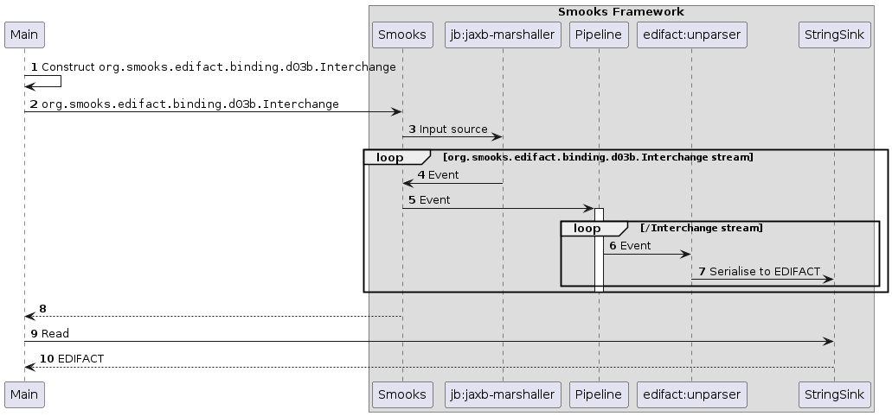

About
=====

Constructs an instance of the [JAXB](https://javaee.github.io/jaxb-v2/) class `org.smooks.edifact.binding.d03b.Interchange`, which is used as a source for Smooks. Thanks to the `jb:jaxb-marshaller` [JavaBean cartridge](https://www.smooks.org/documentation/#javabeans) reader, the instance is turned into an event stream. In order to output the EDIFACT, the `org.smooks.edifact.binding.d03b.Interchange` event stream is fed to a pipeline that serialises the event stream into EDIFACT before writing it out to the sink.

### How to run?

1. `mvn clean package`
2. `mvn exec:exec`

### UML Sequence Diagram

