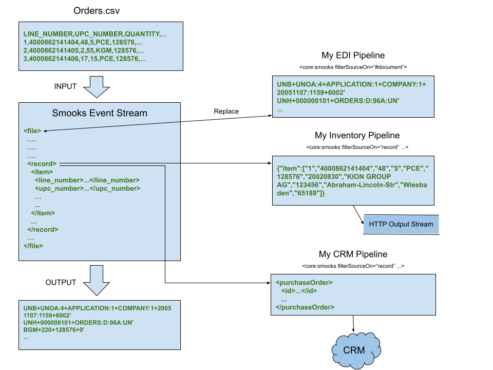

About this example
------------------

This example illustrates the power of pipelines in a real-world use case. Consider this classic data integration problem:

>An organisation is required at the end of day to churn through GBs of customer orders captured in a CSV file. Each individual order is to be communicated to the inventory system in JSON and uploaded as XML to a CRM service. Furthermore, an [EDIFACT](https://unece.org/trade/uncefact/introducing-unedifact) document aggregating the orders needs to be exchanged with the supplier.



Every data integration point is implemented in its own pipeline. Smooks converts the CSV input into a stream of events, triggering the pipelines at different points in the stream. The document root event (i.e., `#document` or `file`) triggers the EDI pipeline while `record` (i.e., order) events drive the inventory and CRM pipelines. Time to get cracking and implement the solution in a Smooks config.

### Reader

The first step to implementing the solution is to turn the CSV file stream into an event stream using the [DFDL](https://daffodil.apache.org/) parser added in Smooks 2.0.0-M1 (alternatively, a simpler but less flexible reader from the CSV cartridge can be used for this purpose):

```xml
<!-- smooks-config.xml -->
<smooks-resource-list xmlns="https://www.smooks.org/xsd/smooks-2.0.xsd"
                      xmlns:core="https://www.smooks.org/xsd/smooks/smooks-core-1.6.xsd"
                      xmlns:dfdl="https://www.smooks.org/xsd/smooks/dfdl-1.0.xsd">

   <dfdl:parser schemaURI="/csv.dfdl.xsd"/>
   
</smooks-resource-list>
```

_csv.dfdl.xsd_ holds the DFDL schema for translating the CSV into XML:

```xml
<!-- csv.dfdl.xsd -->
<xs:schema xmlns:xs="http://www.w3.org/2001/XMLSchema"
           xmlns:dfdl="http://www.ogf.org/dfdl/dfdl-1.0/" xmlns:ex="http://example.com"
           targetNamespace="http://example.com" elementFormDefault="unqualified">

   <xs:include schemaLocation="org/apache/daffodil/xsd/DFDLGeneralFormat.dfdl.xsd" />

   <xs:annotation>
       <xs:appinfo source="http://www.ogf.org/dfdl/">
           <dfdl:defineVariable name="Delimiter" type="xs:string" external="true" defaultValue=","/>

           <dfdl:format ref="ex:GeneralFormatPortable" separator="" initiator=""
                        terminator="" textTrimKind="none" initiatedContent="no" ignoreCase="no"
                        separatorPosition="infix" occursCountKind="implicit"
                        emptyValueDelimiterPolicy="both" representation="text" textNumberRep="standard"
                        lengthKind="delimited" encoding="ASCII" encodingErrorPolicy="replace" />
       </xs:appinfo>
   </xs:annotation>

   <xs:element name="file">
       <xs:complexType>
           <xs:sequence dfdl:separator="%NL;" dfdl:separatorPosition="postfix">
               <xs:element name="header" minOccurs="0" maxOccurs="1"
                           dfdl:occursCountKind="implicit">
                   <xs:complexType>
                       <xs:sequence dfdl:separator="{$ex:Delimiter}">
                           <xs:element name="title" type="xs:string" maxOccurs="unbounded" />
                       </xs:sequence>
                   </xs:complexType>
               </xs:element>
               <xs:element name="record" maxOccurs="unbounded">
                   <xs:complexType>
                       <xs:sequence dfdl:separator="{$ex:Delimiter}">
                           <xs:element name="item" type="xs:string" maxOccurs="unbounded"/>
                       </xs:sequence>
                   </xs:complexType>
               </xs:element>
           </xs:sequence>
       </xs:complexType>
   </xs:element>

</xs:schema>
```

For the above schema, the `dfdl:parser` turns a CSV stream such as the following:

```csv
LINE_NUMBER,UPC_NUMBER,QUANTITY,PRICE,UOM,PO_NUMBER,PO_DATE,CUSTOMER_NAME,CUSTOMER_NUMBER,ADDRESS,CITY,STATE,POSTAL_CODE
1,4000862141404,48,5,PCE,128576,20020830,KION GROUP AG,123456,Abraham-Lincoln-Str,Wiesbaden,,65189
2,4000862141405,2,55,KGM,128577,20020830,Maria Theresa,123457,Maria-Theresien-Strasse,Innsbruck,,AT6020
3,4000862141406,17,15,PCE,128578,20020830,Gianni l-Pastizz,123458,Republic Street,Valletta,,VLT1117
```

into the SAX event stream:

```xml
<ex:file xmlns:ex="http://example.com">
   <header>
      <title>LINE_NUMBER</title>
      <title>UPC_NUMBER</title>
      <title>QUANTITY</title>
      <title>PRICE</title>
      <title>UOM</title>
      <title>PO_NUMBER</title>
      <title>PO_DATE</title>
      <title>CUSTOMER_NAME</title>
      <title>CUSTOMER_NUMBER</title>
      <title>ADDRESS</title>
      <title>CITY</title>
      <title>STATE</title>
      <title>POSTAL_CODE</title>
   </header>
   <record>
      <item>1</item>
      <item>4000862141404</item>
      <item>48</item>
      <item>5</item>
      <item>PCE</item>
      <item>128576</item>
      <item>20020830</item>
      <item>KION GROUP AG</item>
      <item>123456</item>
      <item>Abraham-Lincoln-Str</item>
      <item>Wiesbaden</item>
      <item>65189</item>
   </record>
   ...
</ex:file>
```

The events of interest are the `file`, `record`, and `item` events. Coming up next are the pipeline configurations.

### Inventory Pipeline

The inventory pipeline maps each order to JSON and writes it to an HTTP stream where the organisation’s inventory system is reading on the other end:

```xml
<!-- smooks-config.xml -->
<smooks-resource-list xmlns="https://www.smooks.org/xsd/smooks-2.0.xsd"
                      xmlns:core="https://www.smooks.org/xsd/smooks/smooks-core-1.6.xsd"
                      xmlns:dfdl="https://www.smooks.org/xsd/smooks/dfdl-1.0.xsd">

   <dfdl:parser schemaURI="/csv.dfdl.xsd"/>

   <core:smooks filterSourceOn="record" maxNodeDepth="0">
       <core:action>
           <core:outputTo outputStreamResource="inventoryOutputStream"/>
       </core:action>
       <core:config>
           <smooks-resource-list>
               <resource-config selector="#document">
                   <resource>org.smooks.examples.pipeline.InventoryVisitor</resource>
               </resource-config>
           </smooks-resource-list>
       </core:config>
   </core:smooks>
   ...
</smooks-resource-list>
```

The `filterSourceOn` XPath expression selects the event/s for `core:smooks` to visit. In this snippet, the pipeline visits `record` events, including their child `item` events. The root event in the pipeline’s context is `record`; not `file`. Although the parent of the `item` event is `record`, the latter has no parent node given that it’s the root event in the inventory pipeline. It follows then that the `#document` selector in the inventory pipeline is equivalent to the `record` selector.

`maxNodeDepth` is set to 0 (i.e., infinite) so as to append the item events/nodes to the record tree instead of discarding them. By default, Smooks never accumulates child events in order to keep a low-memory footprint but in this instance we assume the number of item events within a record node is manageable within main memory.

`InventoryVisitor` visits record events and writes its output to a stream declared within the `core:action` element (the output stream is registered programmatically). Drilling down to the `InventoryVisitor` class will yield the Java code:

```java
// InventoryVisitor.java
...
...

public class InventoryVisitor implements AfterVisitor {
   private static final XmlMapper XML_MAPPER = new XmlMapper();
   private static final ObjectMapper OBJECT_MAPPER = new ObjectMapper();
  
   @Override
   public void visitAfter(Element element, ExecutionContext executionContext) {
       try {
           JsonNode jsonNode = XML_MAPPER.readTree(XmlUtil.serialize(element));
           Stream.out(executionContext).write(OBJECT_MAPPER.writeValueAsString(jsonNode));
       } catch (IOException e) {
           throw new SmooksException(e);
       }
   }
}
```

The `AfterVisitor` implementation leverages the popular [Jackson library](https://github.com/FasterXML/jackson) to serialise the record element into JSON which is then transparently written out to `inventoryOutputStream` with `Stream.out(executionContext).write(...)`.

### CRM Pipeline

Like the inventory pipeline, the CRM pipeline visits each `record` event:

```xml
<!-- smooks-config.xml -->
<smooks-resource-list xmlns="https://www.smooks.org/xsd/smooks-2.0.xsd"
                      xmlns:core="https://www.smooks.org/xsd/smooks/smooks-core-1.6.xsd"
                      xmlns:ftl="https://www.smooks.org/xsd/smooks/freemarker-2.0.xsd"
                      xmlns:dfdl="https://www.smooks.org/xsd/smooks/dfdl-1.0.xsd">
  
   <dfdl:parser schemaURI="/csv.dfdl.xsd"/>
  
   ...

   <core:smooks filterSourceOn="record" maxNodeDepth="0">
       <core:config>
           <smooks-resource-list>
               <core:delegate-reader>
                   <ftl:freemarker applyOnElement="#document">
                       <ftl:template>purchaseOrder.xml.ftl</ftl:template>
                   </ftl:freemarker>
               </core:delegate-reader>
               <resource-config selector="purchaseOrder">
                   <resource>org.smooks.examples.pipeline.CrmVisitor</resource>
               </resource-config>
           </smooks-resource-list>
       </core:config>
   </core:smooks>
  
</smooks-resource-list>
```

Spot the differences between the inventory and CRM pipelines. This pipeline omits `core:action` because the `CrmVisitor` resource HTTP POSTs the result directly to the CRM service. Another notable difference is the appearance of a new Smooks 2 reader.

`core:delegate-reader` delegates the pipeline event stream to an enclosed `ftl:freemarker` visitor which instantiates the underneath template with the selected `record` event as a parameter:

```xml
<!-- purchaseOrder.xml.ftl -->
<purchaseOrder>
   <id>${record.item[6]}</id>
   <productId>${record.item[2]}</productId>
   <quantity>${record.item[3]}</quantity>
   <customerName>${record.item[9]}</customerName>
   <address>${record.item[11]}</address>
   <date>${record.item[7]}</date>
</purchaseOrder>
```

`core:delegate-reader` goes on to feed Freemarker’s instantiated template to `CrmVisitor`, in other words, `core:delegate-reader` converts the pipeline event stream into one `CrmVisitor` can visit:

```java
// CrmVisitor.java
...
...

public class CrmVisitor implements AfterVisitor {

   private static final Logger LOGGER = LoggerFactory.getLogger(CrmVisitor.class);

   private AsyncHttpClient asyncHttpClient;

   @PostConstruct
   public void postConstruct() {
       this.asyncHttpClient = asyncHttpClient();
   }

   @Override
   public void visitAfter(Element element, ExecutionContext executionContext) {
       Request request = post("https://crm.example/api/orders").setHeader("Content-Type", "application/xml").setBody(XmlUtil.serialize(element)).build();
       asyncHttpClient.executeRequest(request, new AsyncCompletionHandler<Response>() {
           @Override
           public Response onCompleted(Response response) {
               if (response.getStatusCode() != 200) {
                   LOGGER.error("Error => " + response.getResponseBody(StandardCharsets.UTF_8));
               }
               return response;
           }
       });
   }

   ...
}
```

`CrmVisitor`’s code should be self-explanatory. Observe `org.asynchttpclient.AsyncHttpClient` is referenced in `visitAfter(...)`to perform a non-blocking HTTP POST. All framework execution in Smooks happens in a single thread so blocking calls should be avoided to keep the throughput rate acceptable.

### EDI Pipeline

The EDI pipeline requires more thought than the earlier pipelines because (a) it needs to aggregate the orders, (b) wrap a header and footer around the aggregated orders, and (c) convert the event stream into one that the `edifact:unparser` visitor can digest. After which it needs to write `edifact:unparser`’s EDI output to the result stream, overwriting the XML stream produced from the `dfdl:parser` reader. The latter is accomplished with the `replace` pipeline action:

```xml
<!-- smooks-config.xml -->
<smooks-resource-list xmlns="https://www.smooks.org/xsd/smooks-2.0.xsd"
                      xmlns:core="https://www.smooks.org/xsd/smooks/smooks-core-1.6.xsd"
                      xmlns:ftl="https://www.smooks.org/xsd/smooks/freemarker-2.0.xsd"
                      xmlns:edifact="https://www.smooks.org/xsd/smooks/edifact-2.0.xsd"
                      xmlns:dfdl="https://www.smooks.org/xsd/smooks/dfdl-1.0.xsd">

   <dfdl:parser schemaURI="/csv.dfdl.xsd"/>

   ...
   ...
  
   <core:smooks filterSourceOn="#document">
       <core:action>
           <core:inline>
               <core:replace/>
           </core:inline>
       </core:action>
       ...
   </core:smooks>

</smooks-resource-list>
```

The selector for this pipeline is set to `#document`; not `record`. `#document`, which denotes the opening root tag, leads to the pipeline firing only once, necessary for creating a single EDIFACT document header and footer. We’ll worry later about how to enumerate the `record` events.

The subsequent pipeline config leverages `core:delegate-reader`, introduced in the previous pipeline, to convert the event stream into a stream `edifact:unparser` (covered furthered on) can understand:

```xml
<!-- smooks-config.xml -->
<smooks-resource-list xmlns="https://www.smooks.org/xsd/smooks-2.0.xsd"
                      xmlns:core="https://www.smooks.org/xsd/smooks/smooks-core-1.6.xsd"
                      xmlns:ftl="https://www.smooks.org/xsd/smooks/freemarker-2.0.xsd"
                      xmlns:edifact="https://www.smooks.org/xsd/smooks/edifact-2.0.xsd"
                      xmlns:dfdl="https://www.smooks.org/xsd/smooks/dfdl-1.0.xsd">

   <dfdl:parser schemaURI="/csv.dfdl.xsd"/>

   ...
   ...
  
   <core:smooks filterSourceOn="#document">
       <core:action>
           <core:inline>
               <core:replace/>
           </core:inline>
       </core:action>
       <core:config>
           <smooks-resource-list>
               <core:delegate-reader>
                   <ftl:freemarker applyOnElement="#document" applyBefore="true">
                       <ftl:template>header.xml.ftl</ftl:template>
                   </ftl:freemarker>
                   <core:smooks filterSourceOn="record" maxNodeDepth="0">
                       <core:config>
                           <smooks-resource-list>
                               <ftl:freemarker applyOnElement="#document">
                                   <ftl:template>body.xml.ftl</ftl:template>
                               </ftl:freemarker>
                           </smooks-resource-list>
                       </core:config>
                   </core:smooks>
                   <ftl:freemarker applyOnElement="#document">
                       <ftl:template>footer.xml.ftl</ftl:template>
                   </ftl:freemarker>
               </core:delegate-reader>

               ...
           </smooks-resource-list>
       </core:config>
   </core:smooks>

</smooks-resource-list>
```

`core:delegate-reader` delivers the pipeline event stream to its child visitors. Triggered FreeMarker visitors proceed to materialise their templates and have their output fed to the `edifact:unparser` for serialisation. The previous snippet has a lot to unpack therefore a brief explanation of each enclosed visitor’s role is in order.


* ##### Header Visitor

```xml
<!-- smooks-config.xml -->
<core:delegate-reader>
   <ftl:freemarker applyOnElement="#document" applyBefore="true">
      <ftl:template>header.xml.ftl</ftl:template>
   </ftl:freemarker>
   ...
</core:delegate-reader>
```

On encountering the opening root tag, this FreeMarker visitor feeds the XML header from the _header.xml.ftl_ template to the `edifact:unparser`. The content of _header.xml.ftl_, shown next, is static for illustration purposes. In the real world, one would want to generate dynamically data elements like sequence numbers.

```xml
<!-- header.xml.ftl -->
<D96A:Interchange xmlns:xsi="http://www.w3.org/2001/XMLSchema-instance"
                  xmlns:D96A="http://www.ibm.com/dfdl/edi/un/edifact/D96A"
                  xmlns:srv="http://www.ibm.com/dfdl/edi/un/service/4.1">
<UNB>
    <S001>
        <E0001>UNOB</E0001>
        <E0002>1</E0002>
    </S001>
    <S002>
        <E0004>SENDER1</E0004>
        <E0007>14</E0007>
        <E0008>ZZUK</E0008>
    </S002>
    <S003>
        <E0010>RECEIVER1</E0010>
        <E0007>1</E0007>
        <E0014>ZZUK</E0014>
    </S003>
    <S004>
        <E0017>071101</E0017>
        <E0019>1701</E0019>
    </S004>
    <E0020>131</E0020>
    <E0026>ORDERS</E0026>
    <E0031>1</E0031>
    <E0035>1</E0035>
</UNB>
<D96A:Message>
    <UNH>
        <E0062>000000101</E0062>
        <S009>
            <E0065>ORDERS</E0065>
            <E0052>D</E0052>
            <E0054>96A</E0054>
            <E0051>UN</E0051>
        </S009>
    </UNH>
    <D96A:ORDERS>
        <BGM>
            <C002>
                <E1001>220</E1001>
            </C002>
            <E1004>128576</E1004>
            <E1225>9</E1225>
        </BGM>
        <DTM>
            <C507>
                <E2005>137</E2005>
                <E2380>20020830</E2380>
                <E2379>102</E2379>
            </C507>
        </DTM>
        <SegGrp-2>
            <NAD>
                <E3035>BY</E3035>
                <C082>
                    <E3039>123456</E3039>
                    <E3055>9</E3055>
                </C082>
                <C080>
                    <E3036>Therese House</E3036>
                </C080>
                <C059>
                    <E3042>29-30 Glasshouse Yard</E3042>
                </C059>
                <E3164>London</E3164>
                <E3251>EC1A 4JN</E3251>
                <E3207>UK</E3207>
            </NAD>
        </SegGrp-2>
```

* ##### Body Visitor

```xml
<!-- smooks-config.xml -->
<core:delegate-reader>
   ...
   <core:smooks filterSourceOn="record" maxNodeDepth="0">
      <core:config>
         <smooks-resource-list>
            <ftl:freemarker applyOnElement="#document">
               <ftl:template>body.xml.ftl</ftl:template>
            </ftl:freemarker>
         </smooks-resource-list>
      </core:config>
   </core:smooks>
   ...
</core:delegate-reader>
```

The pipeline within a pipeline collects the item events and appends them to the record tree (`maxNodeDepth="0"`) before pushing the record tree down to the enclosed FreeMarker visitor. As a side note, the body logic could be simplified by unnesting the FreeMarker visitor and setting the `maxNodeDepth` attribute to 0 in the `#document` pipeline. Unfortunately, such a simplification would come at the cost of reading the entire event stream into memory.

The _body.xml.ftl_ template warrants a closer look:

```xml
<!-- body.xml.ftl -->
<SegGrp-25>
   <LIN>
       <E1082>${record.item[0]}</E1082>
       <E1229></E1229>
       <C212>
           <E7140>${record.item[1]}</E7140>
           <E7143>SRS</E7143>
       </C212>
   </LIN>
   <QTY>
       <C186>
           <E6063>21</E6063>
           <E6060>${record.item[2]}</E6060>
           <E6411>${record.item[4]}</E6411>
       </C186>
   </QTY>
   <SegGrp-28>
       <PRI>
           <C509>
               <E5125>AAA</E5125>
               <E5118>${record.item[3]}</E5118>
           </C509>
       </PRI>
   </SegGrp-28>
</SegGrp-25>
```

FreeMarker materialises and feeds the above segment group to the `edifact:unparser` for each visited `record` event.

* ##### Footer Visitor

```xml
<!-- smooks-config.xml -->
<core:delegate-reader>
   ...
   <ftl:freemarker applyOnElement="#document">
      <ftl:template>footer.xml.ftl</ftl:template>
   </ftl:freemarker>
</core:delegate-reader>
```

This FreeMarker visitor is fired on the closing root tag, following the serialisation of the header and body. The footer residing in _footer.xml.ftl_ is also fed to the `edifact:unparser`:

```xml
<!-- footer.xml.ftl -->
           <UNS>
               <E0081>S</E0081>
           </UNS>
       </D96A:ORDERS>
       <UNT>
           <E0074>15</E0074>
           <E0062>000000101</E0062>
       </UNT>
   </D96A:Message>
   <UNZ>
       <E0036>1</E0036>
       <E0020>131</E0020>
   </UNZ>
</D96A:Interchange>
```

The final piece to the solution is to configure the `edifact:unparser`:

```xml
<!-- smooks-config.xml -->
<smooks-resource-list xmlns="https://www.smooks.org/xsd/smooks-2.0.xsd"
                      xmlns:core="https://www.smooks.org/xsd/smooks/smooks-core-1.6.xsd"
                      xmlns:ftl="https://www.smooks.org/xsd/smooks/freemarker-2.0.xsd"
                      xmlns:edifact="https://www.smooks.org/xsd/smooks/edifact-2.0.xsd"
                      xmlns:dfdl="https://www.smooks.org/xsd/smooks/dfdl-1.0.xsd">

   <dfdl:parser schemaURI="/csv.dfdl.xsd"/>

   ...
   ...
  
   <core:smooks filterSourceOn="#document">
       <core:action>
           <core:inline>
               <core:replace/>
           </core:inline>
       </core:action>
       <core:config>
           <smooks-resource-list>
               <core:delegate-reader>
                   <ftl:freemarker applyOnElement="#document" applyBefore="true">
                       <ftl:template>header.xml.ftl</ftl:template>
                   </ftl:freemarker>
                   <core:smooks filterSourceOn="record" maxNodeDepth="0">
                       <core:config>
                           <smooks-resource-list>
                               <ftl:freemarker applyOnElement="#document">
                                   <ftl:template>item.xml.ftl</ftl:template>
                               </ftl:freemarker>
                           </smooks-resource-list>
                       </core:config>
                   </core:smooks>
                   <ftl:freemarker applyOnElement="#document">
                       <ftl:template>footer.xml.ftl</ftl:template>
                   </ftl:freemarker>
               </core:delegate-reader>

               <edifact:unparser schemaURI="/d96a/EDIFACT-Messages.dfdl.xsd" unparseOnElement="*">
                   <edifact:messageTypes>
                       <edifact:messageType>ORDERS</edifact:messageType>
                   </edifact:messageTypes>
               </edifact:unparser>
           </smooks-resource-list>
       </core:config>
   </core:smooks>

</smooks-resource-list>
```

As per the `unparseOnElement` wildcard selector, the pipeline delivers all events generated from the `core:delegate-reader` visitors to `edifact:unparser` to be serialised into EDIFACT before the pipeline merges the serialised events with the result stream.