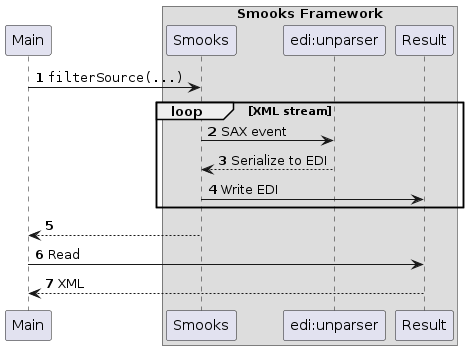

About
=====

This is another example illustrating how Smooks can transform XML streams into another format. In this example, [`edi:unparser`](https://github.com/smooks/smooks-edi-cartridge) is configured to turn the XML stream into EDI. No other transformation is performed on the underlying data.

### How to run?

1. `mvn clean package`
2. `mvn exec:exec`

### UML Sequence Diagram

